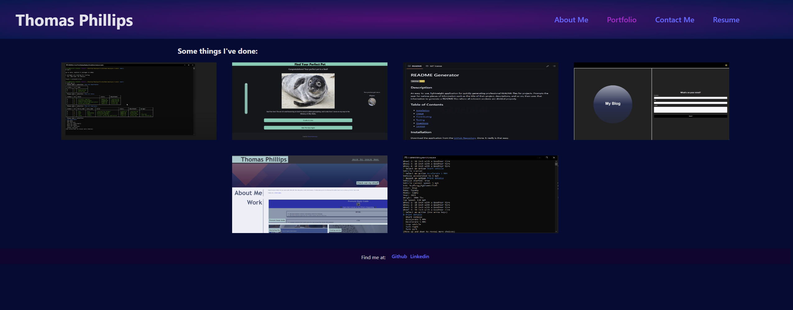

# React Portfolio

## Description
A portfolio site built using React to display the various apps that I have made.

## Table of Contents
- [Installation](#installation)
- [Usage](#usage)
- [Contributing](#contributing)
- [Testing](#testing)
- [Questions](#questions)
- [License](#license)

## Installation
If you'd like to install the site locally, for testing, modification, or otherwise, you can go to the Github repo at https://github.com/Tomjp424/react-portfolio and clone the repo to your local machine.

## Usage
The deployed site can be found at https://subtle-youtiao-3cb28e.netlify.app/.

To navigate, use one of the four links at the top of the page within the header to go to the different pages.

While on the portfolio page, you can use your mouse to hover over one of the images to bring up the name of the project, as well as click on it to navigate to the Github repo for that project.

Within the contact me page, you can fill out a form and click the send button to send me a message.

On the resume page, you can find a brief list of my various skills. If you'd like a more in-depth look, you can click the highlighted text to download my full resume to your machine as a PDF.

## Contributing
If you'd like to contribute to the site, feel free to fork the repo and make whatever modifications you want.

## Testing
You can test the site check the responsiveness of the elements by changing the screen size, or attempting to bypass the form validation on the contact page.

## Questions
- GitHub: [Tomjp424](https://github.com/Tomjp424)
- Email: Tomjp424@gmail.com

## License

Copyright (c) Thomas Phillips.

Licensed under the [MIT](https://opensource.org/licenses/MIT) license.